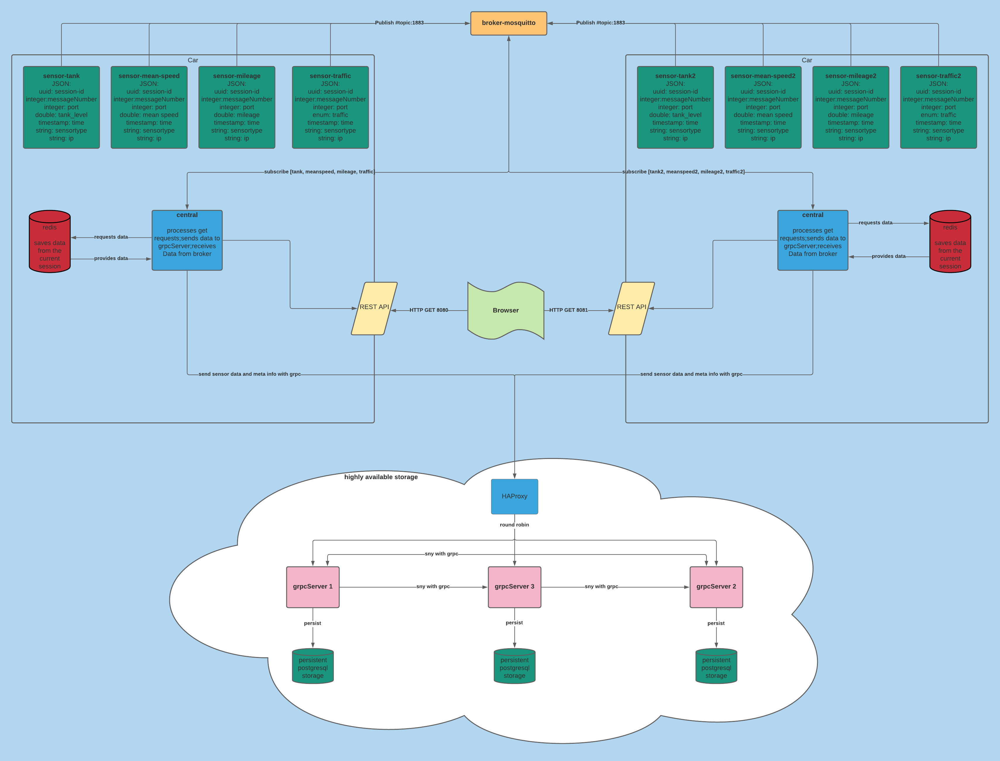

# Distributed Systems WS 2020/2021 - Internship - A. Füssel - K. Kriegbaum
## Description of the HA features and failover features
The new HAProxy sends the messages round robin to the 3 grpc servers. Each grpc server has its own connection to its own postgresql database.  
Each time a grpc server receives a new message from the central, it processes this new message to the other two grpc servers via grpc  
so the persistance level always stays in sync and each database receives each message.  
  
If one grpc server crashes, the other 2 grpc servers keep on working. If the crashed server will be back in under 45 seconds, the system is able to get all grpc and database servers back in sync  
within the next 30 seconds. This is realized with a build in mechanism which checks for differences in the persistance layer each 30 seconds and syncs the last 32 messages.
## Testresults
For the test results, please check the [/Test-results](/Test-results) section in this repository.
## Run tests
First of all, delete the docker container "postgres-server" for cleaner data and easier to understand results.

then, type the following commands:
```
# navigate to the project directory
$ cd projekt-root-dir

# building all necessary project images
$ docker-compose -f docker-compose-testrun.yml build

# launch the system
$ docker-compose -f docker-compose-testrun.yml up
```
You can read the results from your stdout (your bash) and compare timestamps from redis/console/postgresql database).  
For historical testrun data check the test_results dir.  

After finishing the tests, build the normal image again with:  
```
# building all necessary project images
$ docker-compose -f docker-compose.yml build

# launch the system
$ docker-compose -f docker-compose.yml up
```
## Implementation of a car as a distributed system
After a successful build and run via Docker and docker-compose, 4 sensors are running,
that permanently send data to a central.
The central processes the data and outputs them on the standard output.

## REST & HTTP Routen
The central provides a REST Interface that can handle GET requests.
The data generated by the running application can be accessed through the following links:

**Central**:  
http://localhost:8080/

Current Sensor values:  
http://localhost:8080/sensors/

All values of the sensor **mean_speed**:    
http://localhost:8080/sensors/mean_speed/

All values of the sensor **traffic**:   
http://localhost:8080/sensors/traffic/

All values of the sensor **mileage**:   
http://localhost:8080/sensors/mileage/

All values of the sensor **tank**:  
http://localhost:8080/sensors/tank/

**Central-2**:  
http://localhost:8081/

Current Sensor values:  
http://localhost:8081/sensors/

All values of the sensor **mean_speed_two**:    
http://localhost:8081/sensors/mean_speed_two/

All values of the sensor **traffic_two**:   
http://localhost:8081/sensors/traffic_two/

All values of the sensor **mileage_two**:   
http://localhost:8081/sensors/mileage_two/

All values of the sensor **tank_two**:  
http://localhost:8081/sensors/tank_two/


## Used programming language:
JAVA

## Link to our requirements
[Issues Board](https://code.fbi.h-da.de/distributed-systems/2020_wise_lab/group_b_10/-/boards)

## Testing
Our planned tests and their desciptions are documented with corresponding Lables on the [Issues Board](https://code.fbi.h-da.de/distributed-systems/2020_wise_lab/group_b_10/-/boards) 

## Definition of DONE
We understand an issue as DONE if the tutor or professor confirms the issue as completed and the task is therefore considered to have been passed in the sense of the internship. The issue is then moved from the "Ready" column to "Closed".

## Setup:
Make sure you have Docker and Docker-Compose installed in order to run the commands below.

- [Docker](https://docs.docker.com/) - Recommended Version 19.03
- [Docker-Compose](https://docs.docker.com/compose/install/) - Recommended Version 1.24

```
# navigate to the project directory
$ cd projekt-root-dir

# building all necessary project images
$ docker-compose -f docker-compose.yml build

# launch the system
$ docker-compose -f docker-compose.yml up
```

if any unexpected errors occur use this command (at your own risk)
```
$ docker system prune -a -f
```

## Redis
### Commands
Enter the following commands into a CLI to access the values saved by the central
```
# open redis cli
$ redis-cli

# enter redis password
$ AUTH yourpassword

# accessing values
$ LRANGE tank 0 -1
$ LRANGE mileage 0 -1
$ LRANGE traffic 0 -1
$ LRANGE mean_speed 0 -1
```

## PostgreSQL
When accessing the database through the docker CLI use these following commands
```
#Log into database
$ psql -d server_db -U lekko

#Show all tables
server_db=# \dt

#Getting values from tables
server_db=# select * from server_mean_speed;
server_db=# select * from server_tank;
server_db=# select * from server_mileage;
server_db=# select * from server_traffic;
```

## System design


